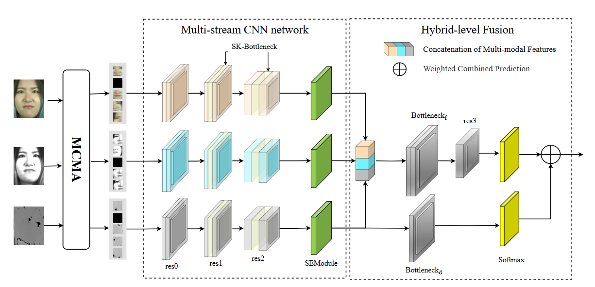
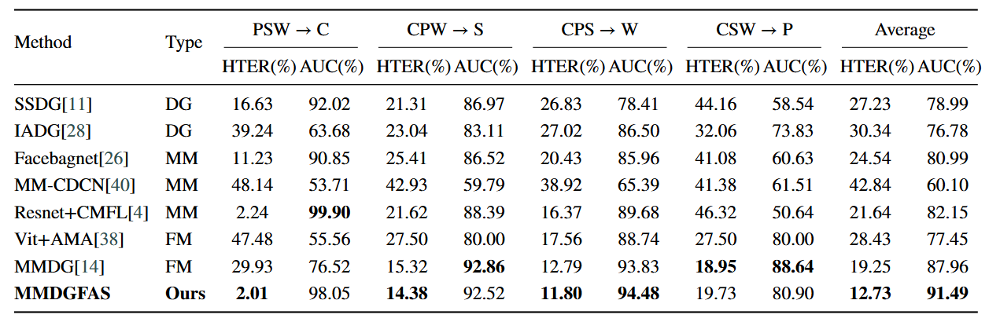

# MMDGFAS
Domain Generalization for Multi-Modal Face Anti-Spoofing via MixCropMask Augmentation and Deep Hybrid-level Fusion

## Overall framework diagram



#### Datasets and Python environment

CASIA-CeFA (denoted as C), [PADISI-Face](https://github.com/vimal-isi-edu/PADISI_USC_Dataset/blob/main/README_FACE.md)  , CASIA-SURF (denoted as S) , and [WMCA]((https://www.idiap.ch/en/scientific-research/data/wmca)) 

- PyTorch 1.11.0

  Python 3.8(ubuntu20.04)

  CUDA 11.3


#### Experiments

Testing results for DG across multiple datasets, including CASIA-CeFA (C), WMCA (W), CASIA-SURF (S), and PADISI (P), under fixed-modal scenarios (Protocol 1).



#### Train multi-modal fusion model
train MMDGFAS model with multi-modal imgs， patch size 48：
```
python train_fusion.py --model=MMDGFAS --image_size=48  --train_test=SCP2W
```
infer
```
python train_fusion.py --mode=infer_test --model=MMDGFAS --image_size=48
```


## Citation
If you find this work or code is helpful in your research, please cite:
```

@article{zhang2025domain,
  title={Domain generalization for multi-modal face anti-spoofing via MixCropMask Augmentation and deep hybrid-level fusion},
  author={Zhang, Botao and Li, Hongjiao},
  journal={Engineering Applications of Artificial Intelligence},
  volume={158},
  pages={111287},
  year={2025},
  publisher={Elsevier}
}

# Special Thanks
@inproceedings{lin2024suppress-29,
  title={Suppress and Rebalance: Towards Generalized Multi-Modal Face Anti-Spoofing},
  author={Lin, Xun and Wang, Shuai and Cai, Rizhao and Liu, Yizhong and Fu, Ying and Tang, Wenzhong and Yu, Zitong and Kot, Alex},
  booktitle={Proceedings of the IEEE/CVF Conference on Computer Vision and Pattern Recognition},
  pages={211--221},
  year={2024}
}

@InProceedings{Shen_2019_CVPR_Workshops,
author = {Shen, Tao and Huang, Yuyu and Tong, Zhijun},
title = {FaceBagNet: Bag-Of-Local-Features Model for Multi-Modal Face Anti-Spoofing},
booktitle = {The IEEE Conference on Computer Vision and Pattern Recognition (CVPR) Workshops},
month = {June},
year = {2019}
}

```


